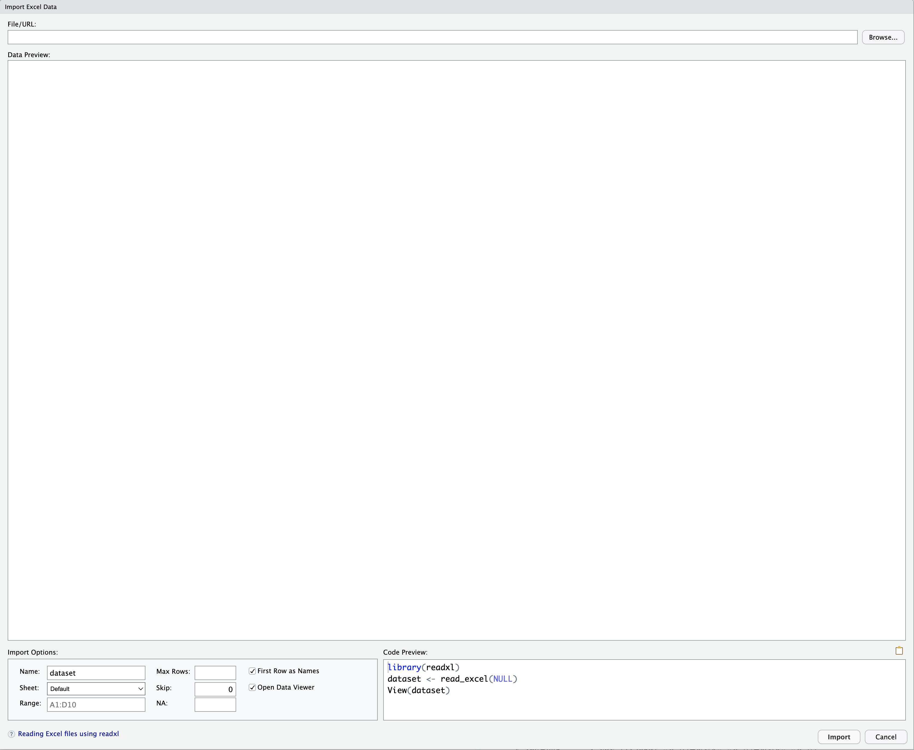
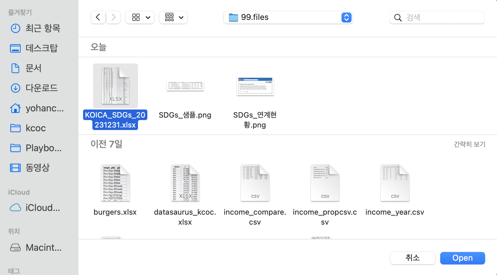
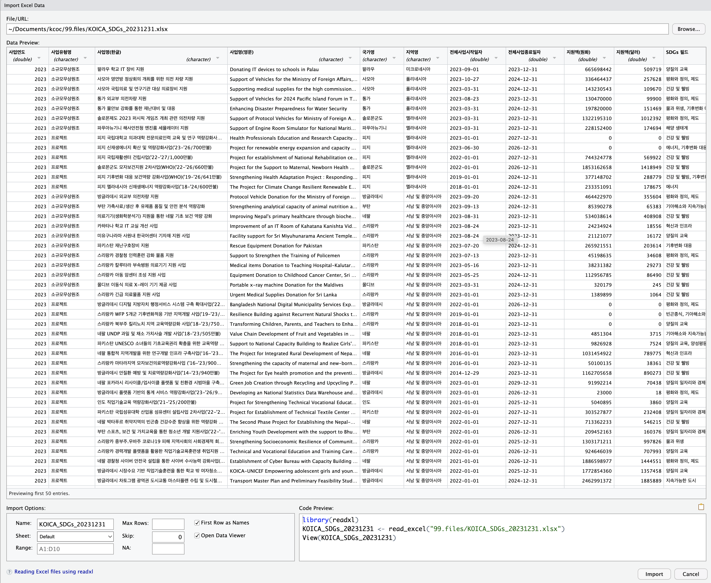

::: callout-note
🛠️ 핵심 패키지

#R 데이터분석의 핵심 패키지 "tidyverse"\
xlsx (엑셀) 파일을 불러오는데 사용되는 패키지 "readxl"\
테이블(표)를 예쁘게 그릴 때 사용되는 패키지 "gt"
:::

```{r}
#| eval: false
#| code-summary: "tidyverse 패키지 로드 Code"

library(tidyverse)            # 라이브러리 로드

```

```{r}
#| eval: false
#| code-summary: "gt 패키지 설치 Code"

install.packages("gt")        # 표 생성 패키지
library(gt)                   # 라이브러리 로드

```

```{r}
#| eval: false
#| code-summary: "readxl 패키지 설치 Code"

install.packages("readxl")    # xlsx 파일 불러오기
library(readxl)               # 라이브러리 로드

```

# 자료 출처

🔗 출처: [공공데이터포탈](https://www.data.go.kr/data/15121333/fileData.do)

[{fig-alt="csv format" width="1800"}](https://www.data.go.kr/data/15121333/fileData.do)

> 데이터 샘플

{width="1800"}

```{r}
#| echo: false
#| warning: false

# 1. 파일 경로 및 Base64 변환 (화면에는 숨겨짐)
#install.packages("downloadthis")
#library(downloadthis)
excel_path <- "../../99.files/KOICA_SDGs_20231231.xlsx" 
b64_data <- base64enc::base64encode(readBin(excel_path, "raw", n = file.info(excel_path)$size))

# 2. 버튼 출력 (이 버튼만 웹 화면에 노출됨)
htmltools::HTML(paste0(
  '<a href="data:application/vnd.openxmlformats-officedocument.spreadsheetml.sheet;base64,', b64_data, '" ',
  'download="KOICA_SDGs_20231231.xlsx" class="btn btn-primary">',
  '<i class="bi bi-download"></i> SDGs 연계현황 엑셀 다운로드</a>'
))

```

## xlsx 파일 불러오기

```{r}
#| label: setup
#| include: false
#| warning: false

library(tidyverse)
library(readxl)

read_xlsx("../../99.files/KOICA_SDGs_20231231.xlsx")


```

<details>

<summary>패키지 설치</summary>

```{r}
#| label: install.package
#| eval: false
#| echo: true
#| warning: false
#| message: false

```

"readxl 패키지 설치 Code"를 완료했다면 생략하세요

1.Packages


2.readxl "입력" -\> Install "클릭"

{width="250"}

</details>

<details>

<summary>엑셀파일 불러오기</summary>

1.Environment


2.Import Dataset \> From Excel...

{width="250"}

3.Browse



4.파일 선택



5.Import



6.(참고) 1\~5 과정은 아래 코드와 동일함

```{r}
#| label: readxl
#| eval: false
#| echo: true
#| warning: false
#| message: false

# library(readxl)
# KOICA_SDGs_20231231 <- read_excel("엑셀파일.xlsx")

```

### 변수에 저장하기

> 변수명: KOICA_SDGs_20231231

```{r}
#| label: sheet
#| include: true
#| warning: false

read_xlsx("../../99.files/KOICA_SDGs_20231231.xlsx") ->  KOICA_SDGs_20231231

print(KOICA_SDGs_20231231)

```

</details>

<br>

# 데이터셋 구조

## 용어 정의

> 데이터는 "데이터프레임", "변수(열)", "관측치(행)", "값(셀)"로 구분합니다.


1.  데이터 프레임(시트): "KOICA 소규모 무상원조 SDGs 연계 현황" 전체 표

2.  변수(열): '번호','사업연도', '사업유형명' 등을 의미 (세로열)

3.  관측치(행): 1, 2023, 소규모무상원조, 사모아 등 한 행을 의미 (가로줄)

4.  값(셀): '폴리네시아', '양질의 교육'와 같은 하나의 값을 의미

<details>

<summary>펼쳐보기</summary>

```{r}
#| code-fold: false

KOICA_SDGs_20231231 |> 
  select(사업연도, 사업유형명, 국가명, 지역명, `SDGs 필드`, 
         `지원액(달러)`, 전체사업시작일자) |> 
  mutate(번호 = row_number(), .before = 1) |> 
  head() |> 
  gt::gt() |> 
  gt::tab_header(
    title = ("KOICA 소규모 무상원조 SDGs 연계 현황")
    )
```

</details>

<br>

## 데이터 보기

> 데이터 셋의 형식과 종류, 크기 등을 알수 있습니다.
>
> tibble 형식이면서 20줄이 넘는 경우 21번째 줄부터 생략합니다.

```{r}
#| code-fold: false

KOICA_SDGs_20231231

```

```{r}
#| code-fold: false
#| code-summary: "table 형식 예시"
#| eval: false

# 참고
Titanic
Titanic |> str()
```

<br>

## 데이터 펼쳐보기

#### view()

> 엑셀의 격자표처럼 한번에 펼쳐보는 함수입니다.

```{r}
#| code-fold: true

KOICA_SDGs_20231231 |> 
  view()

```

<br>

## 데이터 크기

#### dim()

> 데이터가 몇개의 변수와 몇 줄의 관측치로 구성되어 있는지를 의미합니다.

```{r}
#| code-fold: false

KOICA_SDGs_20231231 |> 
  dim()

```

<br>

## 데이터 구성

### glimpse()

> 변수의 종류가 '문자', '숫자', '범주' 등 무엇인지 확인합니다
>
> > 첫번째 변수명은 무엇입니까?
> >
> > 열번째 변수명은 무엇입니까?

```{r}
#| label: glimpse
#| code-fold: false

KOICA_SDGs_20231231 |> 
  glimpse()

```

<br>

### str()

> 사업연도는 '숫자형', '문자형', '시간형' 중 무엇입니까?
>
> 전체사업시작일자는 '숫자형', '문자형', '시간형' 중 무엇입니까?
>
> SDGs 필드는 '숫자형', '문자형', '시간형' 중 무엇입니까?

```{r, str}
#| code-fold: false

KOICA_SDGs_20231231 |> 
  str()

```

<br>

## 데이터 수치 요약

#### summary()

> 숫자형 데이터의 평균, 최솟값, 최댓값을 한번에 확인하는 함수

```{r}
#| code-fold: false

KOICA_SDGs_20231231 |> 
  summary()

```

<br>

# 데이터 가공

## 표 만들기

### count()

> 특정 변수를 기준으로 표를 만들수 있습니다

```{r}
#| code-fold: false

KOICA_SDGs_20231231 |> 
  count(사업유형명)
```

<br>

### 연습문제

> A. 지역명을 기준으로 표를 만드세요

```{r}
#| eval: true

KOICA_SDGs_20231231 |> 
  count(지역명)

```

<br>

> B. 지역명을 기준으로 표를 만드세요

```{r}
#| eval: true

KOICA_SDGs_20231231 |> 
  count(국가명)

```

<br>

> C. SDGs를 기준으로 표를 만드세요

```{r}
#| eval: true

KOICA_SDGs_20231231 |> 
  count('SDG 필드')
```

<br>

## 고유값 확인

#### unique()

> SDGs 필드에는 총 몇개의 목표가 연결되어 있나요?

```{r}
#| eval: false

unique(KOICA_SDGs_20231231$'SDGs 필드')
  
```

<br>

# 탐색적 데이터 분석

## 최댓값 확인

#### slice_max()

> 지원액(달러)를 기준으로 가장 많은 예산이 지원된 사업 10개를 출력합니다

```{r}

KOICA_SDGs_20231231 |> 
  slice_max(order_by = `지원액(달러)`, n = 10) 
  
```

<br>

## 최솟값 확인

#### slice_min()

> 지원액(달러)를 기준으로 가장 적은 예산이 지원된 사업 10개를 출력합니다

```{r}

KOICA_SDGs_20231231 |> 
  slice_min(order_by = `지원액(달러)`, n = 10) 
```

<br>

## 사업시작일자의 분포

#### geom_histogram()

> 사업시작일자의 분포(밀집된 정도)를 살펴봅니다

```{r}

ggplot(KOICA_SDGs_20231231, 
       aes(x = 전체사업시작일자)) + 
  geom_histogram() +
  coord_cartesian(ylim = c(0,10))
```

<br>

### 연습문제

> A.전체사업종료일자의 분포(밀집된 정도)를 시각화하세요

```{r}

ggplot(KOICA_SDGs_20231231, 
       aes(x = 전체사업종료일자)) + 
  geom_histogram()
```

<br>

> 가장 빠른 '전체사업시작일자'는 몇년도 몇월 몇일인가요?

```{r}


KOICA_SDGs_20231231 |> 
  slice_min(전체사업시작일자)

```

<br>

# penguins 연습문제

palmerpenguins 데이터셋을 설치합니다.

{fig-align="center" width="90%"}

```{r}
#| label: palmerpenguins install
#| code-fold: false

if(!require(palmerpenguins))install.packages("palmerpenguins")
library(palmerpenguins)
penguins

```


> 1.  penguins 데이터셋은 몇 행, 몇 열입니까?
>
>     1.  penguins 데이터셋은 몇 개의 변수로 되어 있습니까?
>     2.  penguins 데이터셋은 몇 줄로 되어 있습니까?
>
> 2.  아래 변수들은 각각 무엇을 의미합니까?
>
>     1.  bill_length_mm
>     2.  bill_depth_mm
>     3.  species
>     4.  island
>     5.  flipper_length_mm
>     6.  body_mass_g
>     7.  sex
>     8.  year
>
> 3.  x축 bill_length_mm, y축 bill_depth_mm으로 하는 산점도(geom_point)를 그리시오
>
> 4.  위 그래프를 penguins_kcoc 변수에 넣으시오
>
> 5.  penguins_kcoc 변수에 `+ facet_wrap(.~species)` 를 추가하시오
>
>     `penguins_kcoc + facet_warp(.~species)`
