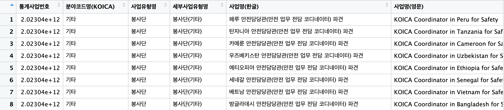

::: callout-note
🛠️ 핵심 패키지

#R 데이터분석의 핵심 패키지 "tidyverse"\
:::

```{r}
#| eval: false
#| code-summary: "tidyverse 패키지"

library(tidyverse)            # 라이브러리 로드

```

```{r}
#| eval: false
#| code-summary: "showtext 패키지"

# install.packages("showtext")        # 표 생성 패키지
library(showtext)                     # 라이브러리 로드
showtext_auto()                       # 한글을 표시

```

# 자료 출처

🔗 출처: [공공데이터포탈](https://www.data.go.kr/data/15051101/fileData.do)


> 데이터 샘플



```{r}
#| echo: false
#| warning: false

# 1. 파일 경로 및 Base64 변환 (화면에는 숨겨짐)
#install.packages("downloadthis")
#library(downloadthis)
excel_path <- "../../99.files/koica_wfk_20260331.csv" 
b64_data <- base64enc::base64encode(readBin(excel_path, "raw", n = file.info(excel_path)$size))

# 2. 버튼 출력 (이 버튼만 웹 화면에 노출됨)
htmltools::HTML(paste0(
  '<a href="data:application/vnd.openxmlformats-officedocument.spreadsheetml.sheet;base64,', b64_data, '" ',
  'download="koica_wfk_20260331.csv" class="btn btn-primary">',
  '<i class="bi bi-download"></i> KOICA 해외봉사단 파견현황</a>'
))

```

<br>

# csv 파일 불러오기

```{r}
#| label: setup
#| include: false
#| warning: false

library(tidyverse)
library(showtext)
showtext_auto()
read_csv("../../99.files/koica_wfk_20260331.csv")

```

## 변수에 저장하기

> 변수명: koica_wfk_20260331

```{r}
#| label: sheet
#| include: true
#| warning: false
#| cache: true

read_csv(
  "../../99.files/koica_wfk_20260331.csv"
  ) ->  koica_wfk_20260331

print(koica_wfk_20260331)

```

</details>

<br>

# 데이터 톺아보기

## 데이터셋 구조보기

#### glimpse()

데이터 셋의 전체 크기, 변수의 자료형을 보여주고, 대략 어떤 값들로 채워져 있는지 정돈된 형태로 출력

> 데이터셋의 물리적 구조를 스냅샷으로 제공

```{r}

koica_wfk_20260331 |> 
  glimpse()

```

<br>

#### summary()

데이터셋의 평균, 중앙값, 이상치(Outlier), NA(결측치) 등을 요약해서 출력

> 데이터셋의 기초 통계량을 리포트

```{r}

koica_wfk_20260331 |> 
  summary()

```

<br>

> 문자형, 범주형 등은 제외하고 연속형 데이터 기초 통계량만 보는 법

```{r}

koica_wfk_20260331 |> 
  select(where(is.double)) |> 
  summary() 

```

<br>

#### 연속형은 제외하고 문자형, 범주형 등의 기초 통계량만 보는 법

```{r}

koica_wfk_20260331 |> 
  select(-where(is.double)) |> 
  summary() 

```

<br>

### 변수명 확인하기

#### colnames()

```{r}

koica_wfk_20260331 |> 
  colnames()

```

<br>

### (Tip) 고유값 살펴보기

데이터셋 각 변수들의 고유한 값들을 한번에 조회합니다.

데이터들의 구성 요소들을 가늠할수 있습니다.

#### 📮 sapply(n_distinct)

```{r}

koica_wfk_20260331 |> 
  sapply(n_distinct)

```

<br>

`enframe() 함수와 함께 사용하면 tibble 형식으로 보기 좋게 출력합니다`

#### 📮 enframe()

```{r}
#| code-fold: true

koica_wfk_20260331 |> 
  sapply(n_distinct) |> 
  enframe(
    name = 'column',
    value = 'value')

```

<br>

### 데이터 체크

```{r}

koica_wfk_20260331 |> 
  count(국가명)

```

<br>

## Raw data 훓어보기

### print(n = Inf)

> 데이터를 생략하지 말고 화면에 모두 출력합니다.

```{r}

# 해당 조건을 충족하는 모든 데이터를 출력 (생략없음)
koica_wfk_20260331 |> 
  filter(파견분야 == '교육') |> 
  print(n = Inf)

# 해당 조건을 충족하는 모든 데이터를 위에서부터 25개만 출력
koica_wfk_20260331 |> 
  filter(파견분야 == '교육') |> 
  print(n = 25)

```

<br>

#### head()

> 앞에 6줄만 출력

```{r}

koica_wfk_20260331 |> 
  head()

```

<br>

#### tail()

> 뒤에 6줄만 출력

```{r}

koica_wfk_20260331 |> 
  tail()
```

<br>

### (Tip) 그룹별로 훓어보기

#### 📮 split()

지정한 변수의 고유값별로 데이터를 그룹단위로 출력합니다.

```{r}
#| eval: false

koica_wfk_20260331 |> 
  split(koica_wfk_20260331$파견분야) 

```

<br>

# EDA

## 탐색적 데이터 분석

### group_by() + geom_bar()

> 국가별 파견인원을 가로 막대그래프로 그립니다.

```{r}

koica_wfk_20260331 |> 
  group_by(국가명, 파견분야) |> 
  reframe(파견인원_합계 = sum(인원)) |> 
  ggplot(aes(x = 국가명, y = 파견인원_합계, fill = 파견분야)) +
  geom_bar(stat = 'identity') 

```

```{r}
#| echo: true
#| eval: false
#| code-summary: 세로 막대

koica_wfk_20260331 |> 
  group_by(국가명, 파견분야) |> 
  reframe(파견인원_합계 = sum(인원)) |> 
  ggplot(aes(x = 국가명, y = 파견인원_합계, fill = 파견분야)) +
  geom_bar(stat = 'identity') + 
  coord_flip()

```

<br>

### group_by() + geom_tile()

> 국가별 파견분야별 파견인원을 히트맵을 그립니다.

```{r}
#| fig-height: 15
#| fig-width: 12

koica_wfk_20260331 |> 
  group_by(국가명, 파견분야) |> 
  reframe(파견인원_합계 = sum(인원)) |> 
  ggplot(aes(x = 파견분야, y = 국가명, fill = 파견분야)) +
  geom_tile()

```

<br>

### geom_text() + theme_minimal()

> 데이터를 선별하고, 히트맵을 예쁘게 꾸며줍니다.

```{r}


koica_wfk_20260331 |> 
  group_by(국가명, 파견분야) |> 
  reframe(파견인원_합계 = sum(인원)) |> 
  filter(국가명 %in% c("페루", "라오스", "몽골","네팔", 
                    "탄자니아", "베트남", "필리핀")) |> 
  ggplot(aes(x = 파견분야, y = 국가명, fill = 파견인원_합계)) +
  geom_tile(color = 'snow') +
  geom_text(aes(label = 파견인원_합계), color = 'snow', size = 7) +
  theme_minimal() +
  theme(axis.title = element_blank(),
        axis.text = element_text(size = 11))

```

<br>

### 히스토그램

### geom_histogram(bins = 10)

> 파견인원 분포

```{r}

koica_wfk_20260331 |> 
  ggplot(aes(x = 인원)) +
  geom_histogram(bins = 5)

```

#### geom_histogram(binwidth = 1)

```{r}

koica_wfk_20260331 |> 
  ggplot(aes(x = 인원)) +
  geom_histogram(binwidth = 1) 

```

<br>

### 이상치 탐색

geom_boxplot()

> 파견 분야에서 이상치

```{r}

koica_wfk_20260331 |> 
  ggplot(aes(x = 파견분야, y = 인원)) +
  geom_boxplot() 

```

<br>

# 데이터 전처리

## select

```{r}
#| code-fold: false

koica_wfk_20260331 |> 
  select("국가명","파견직종", "파견분야", "인원")

```

<br>

## 할당 연산자

할당연산자를 통해 데이터를 복사할수 있고 할당연산자는 양방향으로 동작합니다.

> -\>
>
> \<-

```{r}
#| code-fold: false

#1안과 2안은 동일한 결과를 출력
# 1안
koica_wfk_20260331 |> 
  select("국가명","파견직종", "파견분야", "인원") -> koica_1_select

# 2안
koica_1_select <- koica_wfk_20260331 |> 
  select("국가명","파견직종", "파견분야", "인원")

```

<br>

## arrange()

특정 기준에 맞춰 오름차순, 내림차순합니다

```{r}

# 인원순서대로 오름차순
koica_1_select |>  
      arrange(인원)

# 인원순서대로 내림차순
koica_1_select |>  
      arrange(desc(인원))

```

<br>

## filter()

#### filter는 조건에 맞춰 데이터를 조회합니다

### 같다

> ==

`국가명이 페루와 같은 것을 출력합니다`

```{r}
#| code-fold: true

koica_1_select |> 
  filter(국가명 == "페루")

```

<br>

### 다르다

> !=

`국가명이 페루와 다른 것을 출력합니다`

```{r}
#| code-fold: true

koica_1_select |> 
  filter(국가명 != "페루")

```

<br>

### 포함한다

> %in%

`국가명이 '페루'이거나, '라오스'이거나, '몽골'인 것을 출력합니다`

```{r}
#| code-fold: true

koica_1_select |> 
  filter(국가명 %in% c("페루", "라오스", "몽골"))

```

<br>

### 포함하지 않는다

> !변수명 %in% c()

`국가명이 '페루'도 아니고 '라오스'도 아니고 '몽골'도 아닌 것을 출력합니다`

```{r}
#| code-fold: true

koica_1_select |> 
  filter(!국가명 %in% c("페루", "라오스", "몽골"))

```

<br>

### 크다, 작다, 크거나 같다, 작거나 같다

> \>, \<, \>=, \<=

```{r}

koica_1_select |> 
  filter(인원 > 10) 

koica_1_select |> 
  filter(인원 >= 13)

koica_1_select |> 
  filter(인원 < 2)

koica_1_select |> 
  filter(인원 <= 2 )
```

<br>

### 제시된 조건을 모두 충족하는 경우 (and 조건)

> &
>
> '앰퍼샌드'라고 읽습니다

```{r}

koica_1_select |> 
  filter(인원 < 2 & 파견직종 == "간호")

koica_1_select |> 
  filter(인원 >= 2 & 파견직종 %in% c("치위생", "자동차", "축산"))

```

<br>

### 제시된 조건에서 하나라도 충족하는 경우 (or 조건)

> \|
>
> '버티컬 바'라고 읽습니다

```{r}

koica_1_select |> 
  filter(파견직종 == '보건의료' | 인원 >= 15)

```

<br>

%in% 와 \| (버티컬바)는 조건 검색하려는 변수의 갯수에 따라 용법이 달라집니다

`- 하나의 변수에 여러 조건을 대입할 때는 %in%`

`- 여러 변수에 걸쳐 조건을 검색할 때는 |(버티컬 바)`

```{r}

koica_1_select |> 
  filter(!국가명 %in% c("페루", "라오스", "몽골"))

koica_1_select |> 
  filter(파견직종 == '보건의료' | 인원 >= 15)

```

<br>

### 응용

위에서 언급한 조건들을 다양하게 조합해서 사용할수 있습니다.

```{r}
#| code-fold: true

koica_1_select |> 
  filter(인원 > 2 & 인원 <= 5) 

koica_1_select |> 
  filter(파견직종 == '수학교육' & 인원 >= 2)

koica_1_select |> 
  filter(파견직종 %in% c("사서", "음악교육", "요리"))

koica_1_select |> 
  filter(파견분야 == '농림수산' | 파견직종 %in% c("자동차"))

```

<br>

## mutate()

> 데이터셋에 어떤 값을 추가하거나 변경할수 있습니다.

```{r}

koica_1_select |> 
  mutate(
    구분 = 'WFK_해외파견실적'
  )

```

<br>

### mutate() + row_number()

> 순서대로 번호를 부여한다

```{r}

koica_1_select |>  
  mutate(
    번호 = row_number(국가명)
    ) |> 
  select(번호, 국가명, 파견직종, 파견분야, 인원)


```

<br>

### mutate() + paste()

> 특정 문자(숫자)를 붙인다

```{r}

#
koica_1_select |>  
  mutate(
    종합정보 = paste(파견분야, 파견직종)
    )

koica_1_select |>  
  mutate(
    종합정보 = paste(파견분야, ">", 파견직종)
    )


```

<br>

### mutate() + sum()

> 합계를 구한다

```{r}

sum(koica_1_select$인원)

koica_1_select |> 
  reframe(
    국가명, 
    파견직종,
    파견분야,
    인원,
    파견인원합계 = sum(인원))

```

<br>

### mutate() + if_else()

> 특정 조건에 맞춰 값을 입력한다

```{r}

koica_1_select |>  
  mutate(
    규모 = if_else(인원 >= 10, "10명 이상", "10명 미만")
    )

```

<br>

#### 📮 Tip

mutate와 NULL을 사용해 특정 열을 지울수도 있습니다.

```{r}

koica_1_select |> 
  mutate(
    파견분야 = NULL
    )

```

<br>

## group_by()

> 데이터를 그룹지어 분류하거나 계산합니다.

<br>

### group_by() + reframe()

```{r}

koica_1_select |> 
  group_by(국가명) |> 
  reframe(파견인원_합계 = sum(인원))

```

<br>

### group_by() + mutate() + row_number()

```{r}

koica_1_select |> 
  group_by(국가명) |> 
  reframe(파견인원_합계 = sum(인원))

```

<br>

🤔 Quiz#1:\
아래 코드를 실행한 후 '파견인원_합계'로 내림차순되도록 코드를 추가하세요

```{r}
#| eval: false
#| code-fold: false

koica_1_select |> 
  group_by(국가명) |> 
  reframe(파견인원_합계 = sum(인원))


```

```{r}
#| echo: true
#| eval: false
#| code-summary: 힌트보기

arrange()
```

<br>

🤔 Quiz#2:

아래 코드는 결과가 같은가요? 다른가요? 다르다면 그 이유는 무엇인가요?

```{r}
#| eval: false
#| code-fold: false

#1
koica_1_select |> 
  count(국가명)

#2
koica_1_select |> 
  group_by(국가명) |> 
  reframe(파견인원_합계 = sum(인원))

```

<br>

🤔 Quiz#3:\
아래처럼 표를 작성하세요

```{r}
#| eval: true
#| echo: false
#| code-fold: false

koica_1_select |> 
  group_by(파견분야) |> 
  reframe(파견인원_합계 = sum(인원)) |> 
  arrange(desc(파견인원_합계))

```

```{r}
#| echo: true
#| eval: false
#| code-summary: 힌트보기

group_by() |> 
  reframe() |> 
  arrange(desc())
```

<br>

🤔 Quiz#4:\
아래처럼 표를 작성하세요

```{r}
#| code-fold: false
#| eval: true
#| echo: false

koica_1_select |> 
  group_by(파견분야, 파견직종) |> 
  reframe(파견인원_합계 = sum(인원)) |> 
  arrange(desc(파견인원_합계))

```

```{r}
#| echo: true
#| eval: false
#| code-summary: 힌트보기

group_by(파견분야, 파견직종)


```

<br>

## 데이터셋 삭제하기

데이터셋을 복제했으므로 불필요한 기존 데이터셋을 삭제

> 특정 데이터셋 삭제

#### rm()

```{r}
#| code-fold: false
#| eval: false

# 기본 
rm(koica_1_select)

# 파이프 활용
koica_1_select |> rm() 

```

<details>

<summary>koica_1_select를 실행하세요</summary>

```{r}
#| echo: true
#| eval: false
#| code-fold: false

# koica_1_select
# Error: object 'koica_1_select' not found'라고 나온다면
# 그 이유는 무엇인가요?
# koica_1_select를 나오게 하려면 위의 몇 번 과정을 재실행해야 하나요?

```

</details>

<br>

# 끝.
