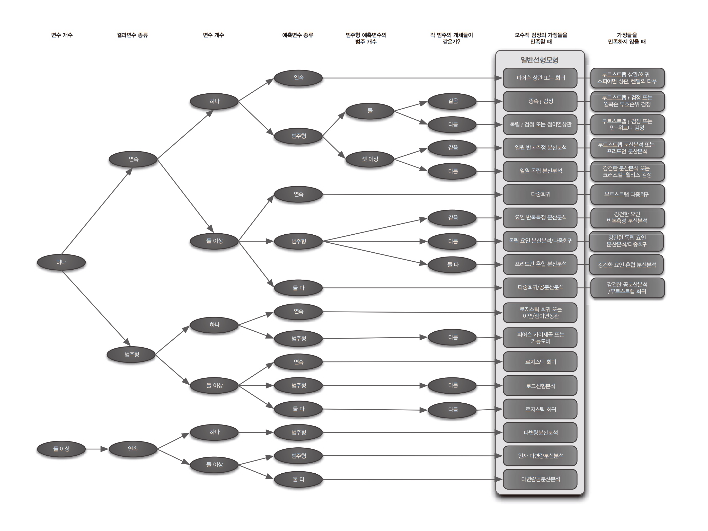

# 준비사항

## 학습 목표

::: {.callout-note icon="false"}
1.  t-검정을 통해 두 평균의 통계적 비교를 배웁니다.
2.  pivot_weder, pivot_longer 함수를 사용해 데이터 구성을 변형합니다.
3.  ggplot2 갤러리를 활용합니다.
4.  treemapify 패키지를 사용해 트리맵을 그립니다.
:::

<br>

## tidyverse 로드

> 항상 tidyverse를 로드합니다.

```{r}

library(tidyverse)            # 라이브러리 로드

```

<br>

## 패키지

> 오늘 사용하는 패키지입니다.

```{r}

# install.packages("treemapify")     # 트리맵
library(treemapify)

```

<br>

# t-검정 실습(1)

## palmerpenguins

> Adelie, Chinstrap, Gentoo 펭귄의 평균 부리길이, 두께, 체중은?

```{r}

library(palmerpenguins)

(penguins |> 
  group_by(species) |> 
  reframe(mean_length = round(mean(bill_length_mm, na.rm = T),1),
          mean_depth = round(mean(bill_depth_mm, na.rm = T), 1),
          mean_mass = round(mean(body_mass_g, na.rm = T), 1),
          n = n()) -> penguins_1_table)

```

<br>

### visualize

> 시각화를 통해 확인합니다

```{r}

penguins_1_table |>                                           
  pivot_longer(cols = !species,
               names_to = "type", 
               values_to = "value") |> 
  ggplot(aes(x = species, y = value)) +
  geom_bar(stat = 'identity') +                             # 막대그래프 
  facet_wrap(.~type, scales = 'free_y') +                   # 그래프 분할
  geom_label(aes(label = value)) +                          # 값 추가
  scale_y_continuous(expand = expansion(mult = c(0, 0.2)))  # y축 20% 여백 추가

```

<br>

## t.test

### Chinstrap vs Gentoo 부리 두께 비교

> Chinstrap 펭귄이 Gentoo 펭귄보다 부리 두께가 평균적으로 3.4mm 더 두껍습니다
>
> 이것은 통계적으로 유의미한가요? (유의미하게 다른가요?)

```{r}

(penguins |> 
  filter(species %in% c('Gentoo', 'Chinstrap')) -> penguins_Gentoo_Chinstrap)

t.test(bill_depth_mm ~ species, data = penguins_Gentoo_Chinstrap)

```

#### 해석

3.4mm의 차이는 통계적으로 유의미하게 다릅니다.

> t = 21.01
>
> p-value = \< 2.2e-16
>
> 95 percent confidence interval: 3.114 \~ 3.76

<br>

### Adelie vs Chinstrap 체중 비교

> Chinstrap 펭귄의 체중이 Adelie 펭귄보다 평균 33g 더 무겁습니다
>
> 이것은 통계적으로 유의미한가요? (유의미하게 다른가요?)

```{r}

penguins_1_table |> 
  filter(species != 'Gentoo') |> 
  select(species, mean_mass, n)

```

<br>

#### t.test() 결과

```{r}

penguins |> 
  filter(species %in% c('Adelie', 'Chinstrap')) -> penguins_Adelie_Chinstrap

t.test(body_mass_g ~ species, data = penguins_Adelie_Chinstrap)

```

#### 해석

33g의 차이는 통계적으로 유의미하지 않습니다 (체중이 다르다고 하기 어렵습니다)

> t = -0.54390 (= 체중 차이 / 표준오차) 차이가 크지 않습니다
>
> p-value = 0.5879
>
> 95 percent confidence interval: -150.38481 \~ 85.53284
>
> -   신뢰구간이 0을 지나면 유의미하지 않습니다 (클 때도 있고 작을 때도 있다)

<br>

### Gentoo vs Chinstrap 부리 길이 비교

> Gentoo 펭귄의 부리 길이가 Chinstrap 펭귄보다 1.3mm 더 깁니다
>
> 이것은 통계적으로 유의미한가요? (유의미하게 다른가요?)

```{r}

t.test(bill_length_mm ~ species, data = penguins_Gentoo_Chinstrap)

```

#### 해석

유의미하게 다릅니다.

> t = 2.706
>
> p-value = 0.00773
>
> 95 percent confidence interval: 0.357 \~ 2.300

<br>

::: callout-note
Adelie 펭귄과 Chinstrap 펭귄의 체중 차이 33g은 통계적으로 유의미하지 않지만, Gentoo 펭귄과 Chinstrap 펭귄의 부리 두께 1.3mm 차이는 통계적으로 유의미하게 다릅니다.

**유의미하게 다르다고 볼수 있다는 것은 어떤 의미일까요?**\
재현성이 있다는 것입니다.

우리가 내일 남극에 가서 Gentoo 펭귄과 Chinstrap 펭귄을 찾아 측정을 해도 Gentoo 펭귄의 부리 길이가 Chinstrap 펭귄보다 더 길 것입니다. 그렇지 않을 확률은 0.77%에 불과합니다. (p-value = 0.00773)

**신뢰구간 0.357 \~ 2.30이 의미하는 바는 무엇일까요?**\
Gentoo 펭귄과 Chinstrap 펭귄의 부리 길이를 여러 차례 표본으로 측정할 경우, 부리 길이 차이는 0.357mm \~ 2.300mm 구간 안에 있을 확률이 95%입니다.
:::

<br>

# 회귀분석

## 심슨 패러독스

🔗 [링크](https://namu.wiki/w/%EC%8B%AC%EC%8A%A8%EC%9D%98%20%EC%97%AD%EC%84%A4)

> 펭귄 부리의 길이가 길수록 부리의 두께도 두꺼워질까?

```{r}

penguins |> 
  ggplot(aes(x = bill_length_mm, y = bill_depth_mm)) +
  geom_point() 
```

<br>

> 추체선을 그려 흩어진 데이터를 해석합니다
>
> 부리가 길수록 두꺼워지나요?

```{r}
#| warning: false
#| message: false

penguins |> 
  ggplot(aes(x = bill_length_mm, y = bill_depth_mm)) +
  geom_point() +
  geom_smooth(method = 'lm', se = F)

```

<br>

> 종족별로 구분합니다

```{r}
#| code-fold: true
#| eval: false
#| message: false
#| error: false

penguins |> 
  ggplot(aes(x = bill_length_mm, y = bill_depth_mm, color = species)) +
  geom_point() +
  geom_smooth(method = 'lm', se = F)

```

<br>

## 분산분석 (ANOVA)

> Gentoo vs Chinstrap 부리 길이
>
> 부리 길이 측정에 성별 차이가 영향을 주었을까?

```{r}
library(showtext)
showtext_auto()

penguins_Gentoo_Chinstrap %>%
  filter(!is.na(sex)) %>% 
  ggplot(aes(x = species, y = bill_length_mm, fill = sex)) +
  geom_boxplot(alpha = 0.7) +
  labs(title = "Species별, Sex별 부리 길이 분포",
       x = "Species", y = "Bill Length (mm)") +
  theme_minimal() +
  scale_fill_brewer(palette = 'Set1')

```

<br>

> 종과 성별을 모두 포함해 분석하는 ANOVA(Two-way) 를 수행합니다

```{r}

# 두 변수의 주효과와 상호작용을 함께 검정
anova_result <- aov(bill_length_mm ~ species * sex, data = penguins_Gentoo_Chinstrap)
summary(anova_result)

```

<br>

# t-검정 실습(2)

> sleep dataset

## 데이터 이해

> 주제: 두 종류의 수면제가 수면 시간에 미치는 효과
>
> 실험 설계: 10명의 환자 각각에게 두 가지 약(group 1, group 2)을 투여하고, 대조군 대비 실험군의 수면 증가 시간을 측정
>
> 관측치: 총 20개 (10명 × 2회 측정)

```{r}

sleep 

```

<br>

## 데이터셋 도움말

> 단순하고 직관적인 데이터셋

```{r}

?sleep

```

<br>

## 데이터셋 설명

> extra: 수면 증가 시간 (numeric, 단위: hours)
>
> group: 투여한 약의 종류 (factor, 1 또는 2)
>
> ID: 환자 ID (factor, 1\~10)

```{r}

sleep

```

### 질문(1)

extra가 양수인 경우는 수면 시간 증가를 의미하나요? 감소를 의미하나요?

### 질문(2)

`sleep` 실험에는 몇 명이 몇 번 참여했나요?

<br>

## pivot_wider(1)

데이터셋을 group 기준의 넓은 형식(wide)으로 변경하고 sleep_wide_group 변수로 저장하시오

```{r}

(sleep |> 
  pivot_wider(names_from = group, 
              values_from = extra, 
              names_prefix = 'extra_') -> sleep_wide_group)

```

<br>

## pivot_wider(2)

데이터셋을 ID 기준의 넓은 형식(wide)으로 변경하고 sleep_wide_id 변수로 저장하시오

```{r}

(sleep |> 
  pivot_wider(names_from = ID, 
              values_from = extra) -> sleep_wide_id)

```

<br>

## pivot_longer

sleep_wide_group 데이터셋을 다시 원래의 긴 형식(long) 으로 변경하시오

```{r}

sleep_wide_id |> 
  pivot_longer(cols = !group,
               names_to = 'ID', 
               values_to = 'extra')

```

```{r}

sleep

```

<br>

## visualize

> 산점도를 그려 데이터를 확인합니다.

```{r}

sleep |> 
  ggplot(aes(x = group, y = extra, color = group)) +
  geom_point(size = 5) 

```

<br>

### 오버플롯팅 해결

> 데이터가 같은 지점에 중복될 때 자리를 비틀 수 있습니다

```{r}

sleep |> 
  ggplot(aes(x = group, y = extra, color = group)) +
  geom_point(position = position_jitter(width = .2), 
             size = 4)

```

<br>

#### 생각해볼 점

> position_jitter(width = .1, height = .1) 할 경우 발생하는 문제점은 무엇인가요?

```{r}
#| code-fold: true

sleep |> 
  ggplot(aes(x = group, y = extra, color = group)) +
  geom_point(position = position_jitter(width = .2, height = .2), 
             size = 4)

```

<br>

## 선으로 이어주기

> 실험자의 변화를 이어줍니다

```{r}

ggplot(sleep, aes(x = group, y = extra)) +
  geom_point(aes(color = group), size = 4) +
  geom_line(color = "gray50", size = 0.4, aes(group = ID)) +
  theme_minimal() +
  scale_color_brewer(palette = 'Set1') 

```

<br>

## t.test

> 같은 사람이 두번씩 실험에 참여했으므로 대응표본을 적용합니다
>
> 대응표본 적용을 위해 pivot_wider로 변형해둔 sleep_wide_group 데이터셋을 사용합니다

```{r}

sleep_wide_group
t.test(sleep_wide_group$extra_1, sleep_wide_group$extra_2, paired = T)

```

<br>

### 해석

1번약과 2번약의 수면 효과는 유의미하게 다릅니다 (2번약을 복용했을 때 수면시간이 1.58시간 더 증가합니다.

> mean difference: -1.58 (10명 환자의 평균 수면 시간 차이)
>
> t = -4.0621 (= mean difference / 표준오차)
>
> -   표준오차 대비 평균 차이가 4.06 배 크다는 의미이므로 실험 효과가 큽니다
>
> -   부호는 신경 쓰지 않고 크기(절대값 4.06)만 보면 됩니다
>
> p-value = 0.002833 (= 0.28%)
>
> -   이 실험결과 우연일 확률은 0.28%
>
> -   다른 표본으로 테스트해도 99.72% 유사하게 재현될 것입니다
>
> 95 percent confidence interval: -2.45 \~ -0.70
>
> -   구간 전체가 마이너스($-$) 영역에 존재하며, **`0`을 포함하지 않습니다.**
>
> -   여러차례 반복 실험을 할 경우 그 실험 결과의 95%는 0.7시간에서 2.45시간 더 수면 효과가 클 것입니다

<br>

# 통계가 복잡한 이유

::: callout-tip

:::

<br>

## 두 평균의 비교 정의

> 두 그룹의 차이가 통계적으로 유의미한지 알고자 할 때 수행

### A와 B 그룹이 있을 경우

> 단일 표본: A의 평균과 어떤 값을 비교 (1번 수면약은 효과가 있는가?) [링크](#sec-one-sample)
>
> 독립 표본: A그룹의 평균과 B 그룹의 평균을 비교 (Gentoo vs Chinstrap 부리 길이 비교)
>
> 대응 표본: A그룹 평균의 Before, After를 비교 (1번약과 2번약의 수면효과는 유의미한가?)

<br>

## 문제

1.  1번약과 2번약의 수면 시간 평균을 구하시오

    ```{r}
    #| echo: false

    sleep |> 
      group_by(group) |> 
      summarise(mean_extra = mean(extra))

    ```

2.  평균을 비교했을 때 수면 시간 증가에 더욱 효과적인 약은 무엇인가요? (group1 or group2)

    ```{r}
    #| code-fold: false

    # 정답: group2 
    # 2번 약의 평균 증가량이 2.33시간으로 1번 약의 0.75시간보다 큼

    ```

3.  참가자별로 수면 시간의 증감 평균을 구하시오

    ```{r}
    #| echo: false

    sleep |> 
      group_by(ID) |> 
      summarise(patient_mean = mean(extra))

    ```

4.  1번약과 2번약을 포함해 수면 시간이 가장 많이 증가한 참가자는 누구인가요?

    ```{r}

    sleep |> 
      arrange(desc(extra)) |> 
      slice(1) 

    ```

5.  1번약과 2번약 모두 수면 시간이 증가하지 않은 (효과가 없는) 참가자는 누구인가요?

    ```{r}
    #| echo: false

    sleep_wide_group |> 
      filter(extra_1 <= 0 & extra_2 <= 0)

    ```

    #### \[단일표본\] {#sec-one-sample}

6.  1번약은 통계적으로 수면 시간 증대 효과가 있었나요?\
    (신뢰구간이 0을 지나간다는 것은 무엇을 의미하나요?)

    ```{r}
    #| echo: false

    t.test(sleep_wide_group$extra_1, mu = 0)

    ```

7.  2번약은 통계적으로 수면 시간 증대 효과가 있었나요?

    ```{r}

    t.test(sleep_wide_group$extra_2, mu = 0)

    ```

8.  1번약과 2번약을 통계적으로 검정할 때 사용해야 하는 t검정 기법은 무엇인가요?

    ```{r}
    #| code-fold: false

    #대응표본 t-검정 (Paired t-test)

    ```

<br>

# treemap

```{r}

# install.packages("treemapify")     # 트리맵
library(treemapify)

```

```{r}

ggplot(G20, aes(area = gdp_mil_usd, fill = hdi, label = country)) +
  geom_treemap() +
  geom_treemap_text(fontface = "italic", colour = "white", place = "centre",
                    grow = TRUE)
```
