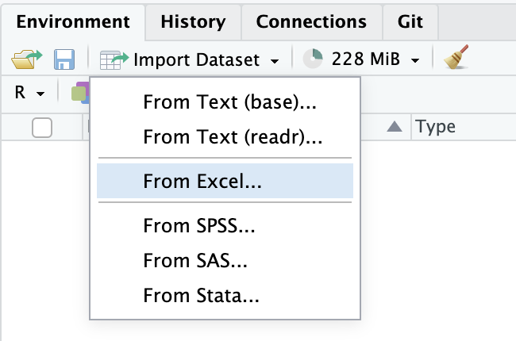
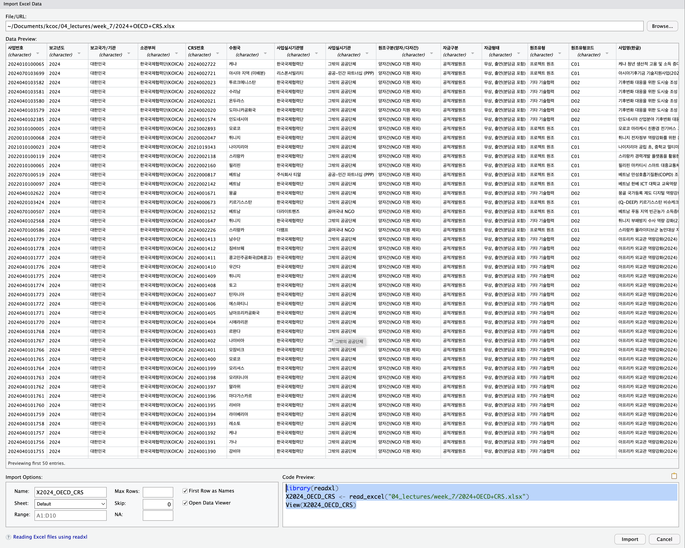

# 개요

## 사용할 패키지

```{r}
#| label: setup
#| message: false
#| echo: true

library(tidyverse)
library(readxl)     #xlsx 데이터 불러오기
library(writexl)    #xlsx 포맷으로 결과 출력하기
library(treemapify) #treemap
library(showtext)   #한글 출력 패키지
showtext_auto()     #한글 출력하기

```

<br>

## 대륙별 담당

- 아시아: 김수진님, 박상애님, 박중열님, 방혜린님

- 아프리카: 신창민님, 오정민님, 정진실님, 박지원님

- 아메리카: 이정수님, 이하늬님, 이명희님, 이윤임님

<br>

```{r}
#| echo: false
#| warning: false

# 1. 파일 경로 및 Base64 변환 (화면에는 숨겨짐)
#install.packages("downloadthis")
#library(downloadthis)
excel_path <- "./2024+OECD+CRS.xlsx"
b64_data <- base64enc::base64encode(readBin(excel_path, "raw", n = file.info(excel_path)$size))

# 2. 버튼 출력 (이 버튼만 웹 화면에 노출됨)
htmltools::HTML(paste0(
  '<a href="data:application/vnd.openxmlformats-officedocument.spreadsheetml.sheet;base64,', b64_data, '" ',
  'download="2024+OECD+CRS.xlsx" class="btn btn-primary">',
  '<i class="bi bi-download"></i> KOICA 2024 OECD CRS</a>'
))
```

<br>

## 데이터 불러오기

> 불러온 koica 데이터를 "X2024_OECD_CRS" 변수명으로 저장합니다
>
> 아래 코드는 제 노트북의 경로입니다. 선생님들 노트북마다 경로가 다르므로 자신의 경로를 입력하세요.\
> 경로에 익숙하지 않으면 아래 펼쳐보기를 클릭해 Import Dataset을 사용해도 됩니다.
>
> Import Dataset은 변수명을 "X2024_OECD_CRS"으로 (동일하게) 저장할 것입니다

```{r}
#| echo: true

read_xlsx("./2024+OECD+CRS.xlsx") -> X2024_OECD_CRS

```

<details>

<summary>펼쳐보기</summary>

{width="500"}

{width="600"}

</details>

## 데이터셋을 복사(백업)합니다.

> X2024_OECD_CRS -\> koica_1_2024xlsx
>
> 데이터를 분석하다보면 값이 엉키거나 몇 단계 전으로 되돌아가야할 경우가 있습니다
>
> 그 때를 대비해 불러온 데이터를 새로운 변수로 복사한 후 새로운 변수로 분석합니다(좋은 습관입니다)

```{r}
#| eval: false

read_xlsx("./04_lectures/week_7/2024+OECD+CRS.xlsx")

```

X2024_OECD_CRS 불러온 데이터셋

koica_1_2024xlsx 복사해서 분석에 사용할 데이터셋

```{r}
#| echo: true

X2024_OECD_CRS  -> koica_1_2024xlsx

```

<br>

## 전체 살펴보기

> 전체 데이터를 훓어봅니다

```{r}
#| eval: false

koica_1_2024xlsx |> 
  view()

```

# 톱아보기

## 변수 개수 확인

> 데이터는 몇 행, 몇 열입니까?
>
> glimpse

```{r}

koica_1_2024xlsx |> glimpse() 

```

``` r


```

<br>

## 변수명 확인

> 38번째 변수명은 무엇입니까?
>
> colnames()

``` r


```

```{r}

koica_1_2024xlsx |> colnames()

```

<br>

## 고유값 확인

> 변수별로 고유값을 확인합니다
>
> sapply(), n_distnict, enframe(), print()

``` r


```

```{r}

koica_1_2024xlsx |> 
  sapply(n_distinct) |> 
  enframe() |> 
  print(n = Inf)

```

<br>

## 결측값 확인

> 결측값의 분포를 대략 확인합니다.
>
> is.na(), colSums(), enframe(), print(n = Inf)
>
> 38번 항목 약정액에는 몇개의 결측값이 있나요?

``` r


```

```{r}

koica_1_2024xlsx |> 
  is.na() |> 
  colSums() |> 
  enframe() 

```

<br>

## 결측값 제로 변수

> 결측값이 없는 (모든 값이 다 들어있는) 변수는 몇개인가요?
>
> filter(value == 0)

``` r


```

```{r}

koica_1_2024xlsx |> 
  is.na() |> 
  colSums() |> 
  enframe() |> 
  filter(value == 0)

```

<br>

## 특정 조건 정렬

> 지출액이 가장 큰 사업 10개의 사업번호, 사업실시기관명, 지출액, 지역, 사업명(한글)을 출력하시오
>
> arrange(), desc(), select()

``` r


```

```{r}

koica_1_2024xlsx |> 
  arrange(desc(지출액)) |> 
  select(사업번호, 사업실시기관명, 지출액, 지역, '사업명(한글)')

```

<br>

# 요약

## 기술 통계 및 요약

> `사업실시기관명`별로 총 지출액의 합계, 평균, 총 사업 수 요약하세요
>
> group_by(), reframe(), mean(), sum(), n(), arrange(), desc()

``` r


```

```{r}

koica_1_2024xlsx |> 
  group_by(사업실시기관명) |> 
  reframe(지출액합계 = sum(지출액), 
          지출액평균 = mean(지출액), 
          총사업수 = n()) |> 
  arrange(desc(총사업수))

```

<br>

## 히스토그램

> 지출액을 히스토그램으로 시각화하세요
>
> 원조유형별로 면분할하세요

``` r


```

```{r}

koica_1_2024xlsx |> 
  ggplot(aes(x = 지출액)) +
  geom_histogram() +
  theme_minimal() +
  #scale_x_continuous(labels = scales::comma)  +
  facet_wrap(.~원조유형, scales = 'free')

```

<br>

## 지출액 크기

> x축 = 약정액, y축 = 지출액 산점도를 그리세요.
>
> geom_point()

``` r


```

```{r}

koica_1_2024xlsx |> 
  ggplot(aes(x = 약정액, y = 지출액)) +
  geom_point()


```

<br>

## 아웃라이어 제거

> 약정액이 80000000 을 초과하는 사업이 1건 있습니다.
>
> 해당 사업의 큰 규모가 다른 사업의 파악을 방해하므로 제외한 후 다시 산점도를 그리세요
>
> geom_point()

``` r


```

```{r}

koica_1_2024xlsx |> 
  filter(약정액 < 80000000) |> 
  ggplot(aes(x = 약정액, y = 지출액)) +
  geom_point()

```

<br>

## 원조유형별 회귀선

> 원조유형별 회귀선을 그어 약정액 대비 지출액의 추세를 파악하세요
>
> 회귀선을 그을 때는 45도의 비교선을 함께 긋고,
>
> 그래프의 가로,세로 비율을 1:1로 맞추어야 합니다.
>
> geom_smooth(), facet_wrap(), geom_abline(), lims()

``` r


```

```{r}
#| echo: true

koica_1_2024xlsx |> 
  filter(약정액 < 80000000) |> 
  ggplot(aes(x = 약정액, y = 지출액, color = 원조유형)) +
  geom_point() +
  geom_smooth(method = 'lm', se = F) +
  facet_wrap(.~원조유형) +
  geom_abline(intercept = 0, slope = 1, 
              color = "grey50", linetype = "dashed", size = 0.8) +
  theme(legend.position = 'top') +
  lims(x = c(0, 30000000), y = c(0, 30000000))

```

<br>

## 약정액 대비 지출액 비율

> '프로젝트 원조'의 약정액 대비 지출액의 비율을 계산하세요
>
> > drop_na(), mutate(), select(), filter(), bbc_style()

``` r


```

```{r}
#| fig-height: 8
#| echo: true

koica_1_2024xlsx |> 
  drop_na(약정액, 지출액) |> 
  mutate(지출액비율 = 지출액 / 약정액, 
         구분 = case_when(지출액비율 > 1 ~ '초과집행', 
                        지출액비율 == 1 ~ '준수', 
                        지출액비율 < 1 ~ '미달집행')
         ) |> 
  count(구분) |> 
  mutate(비율 = n / sum(n) * 100) |> 
  ggplot(aes(x = 구분, y = 비율, fill = 구분)) +
  geom_bar(stat = 'identity') +
  bbplot::bbc_style() +
  geom_text(aes(label = paste0(round(비율,1),"%")), 
            #position = position_stack(.5), 
            vjust = -.1,
            size = 6) 


```

<br>

## 약정액 대비 지출액 비율

> 약정액보다 지출액이 많은 사업은 몇개인가요?
>
> > 약정액 혹은 지출액이 결측값인 관측값을 제외하세요
> >
> > 약정액 대비 지출액 비율 변수를 만들고 100% 초과 사업의 분야를 파악하세요
> >
> > 사업번호, 사업실시기관명, 지출액비율, 지출액, 약정액만 출력하세요 (지출액비율 높은 순서)
> >
> > drop_na(), mutate(), select(), filter(),

``` r


```

```{r}

koica_1_2024xlsx |> 
  drop_na(약정액, 지출액) |> 
  mutate(지출액비율 = 지출액 / 약정액) |> 
  select(사업번호, 사업실시기관명, 지출액비율, 지출액, 약정액) |> 
  filter(지출액비율 > 1)

```

<br>

## 엑셀 파일 출력

> 위에서 구한 값을 엑셀파일로 출력하세요
>
> 엑셀파일명: 초과지출사업.xlsx
>
> write_xlsx()

``` r


```

```{r}

koica_1_2024xlsx |> 
  drop_na(약정액, 지출액) |> 
  mutate(지출액비율 = 지출액 / 약정액) |> 
  select(사업번호, 사업실시기관명, 지출액비율, 지출액, 약정액) |> 
  filter(지출액비율 > 1) |> 
  write_xlsx("./초과지출사업.xlsx")

```

<br>

## 상관관계

> 약정액과 지출액의 상관관계를 구하세요.

``` r


```

> 스피어만 vs 피어슨 상관계수
>
> 아웃라이어 포함 vs 제외

```{r}
#| echo: true

koica_1_2024xlsx |> 
  drop_na(약정액, 지출액) -> koica_2_2024dropna

cor(koica_2_2024dropna$약정액, 
    koica_2_2024dropna$지출액, 
    method = "spearman")

cor(koica_2_2024dropna$약정액, 
    koica_2_2024dropna$지출액, 
    method = "pearson")

koica_2_2024dropna |> 
  filter(약정액 < 80000000) -> koica_3_2024dropnafilter

cor(koica_3_2024dropnafilter$약정액, 
    koica_3_2024dropnafilter$지출액, 
    method = "spearman")

cor(koica_3_2024dropnafilter$약정액, 
    koica_3_2024dropnafilter$지출액, 
    method = "pearson")

  
```

<br>

## 주요 수원국 비교

> 수원국별로 사업건수를 조회하세요
>
> 사업건수가 많은 수원국 상위 10개를 막대그래프로 시각화하세요
>
> count(), slice(), geom_bar(), geom_label(), theme_minimal(), theme()

``` r


```

```{r}

koica_1_2024xlsx |> 
  count(수원국, sort = T) |> 
  slice(1:10) |> 
  ggplot(aes(x = 수원국,
             y = n)) +
  geom_bar(stat = 'identity') + 
  geom_label(aes(label = n), size = 5) +
  theme_minimal() +
  theme(axis.text = element_text(size = 9))

```

<br>

## 막대그래프 정렬

> 사업건수가 많은 순서대로 막대그래프로 정렬하세요
>
> ggplot(aes(x = 수원국 \|\> fct_reorder(desc(n)), y = n))

``` r


```

```{r}

koica_1_2024xlsx |> 
  count(수원국, sort = T) |> 
  slice(1:10) |> 
  ggplot(aes(x = 수원국 |> fct_reorder(desc(n)),
             y = n)) +
  geom_bar(stat = 'identity') + 
  geom_label(aes(label = n), size = 5) +
  theme_minimal() +
  theme(axis.text = element_text(size = 9))

```

<br>

# 데이터 분할

## 지역 분리하기

> 가장 많은 사업이 진행된 지역은 어디인가요?
>
> count(), 지역

``` r


```

```{r}

koica_1_2024xlsx |> 
  count(지역)

```

<br>

## 지역 분리하기

> 아메리카 \> 남아메리카 처럼 지역이 2\~3개로 묶여 있습니다.
>
> 지역을 대륙, 지역1, 지역2처럼 3개의 변수로 분리하세요
>
> 변수를 분리한 후 "koica_4_2024separate'변수에 저장하세요
>
> "koica_4_2024separate" 변수에서 사업번호, 대륙, 지역1, 지역2만 출력하세요
>
> separate_wider_delim()

``` r


```

```{r}
#| echo: true

koica_1_2024xlsx |> 
  separate_wider_delim(
    지역, 
    delim = " > ", 
    names = c("대륙", "지역1", "지역2"), 
    too_few = "align_start"
    #too_many = "merge"
  ) -> koica_4_2024separate

koica_4_2024separate |> 
  select(사업번호, 대륙, 지역1, 지역2)

```

<br>

## 성평등 관련 지출액 비중

> 성평등 항목 중 "관련내용이 주요(1차적) 목적인 경우"의 총지출액을 대륙, 지역1별로 출력하세요
>
> koica_4_2024separate, filter(), group_by(), reframe(), sum(), n()

``` r


```

```{r}

koica_4_2024separate |> 
  filter(성평등 == '관련내용이 주요(1차적) 목적인 경우') |> 
  group_by(대륙, 지역1) |> 
  reframe(총지출액 = sum(지출액), 
          사업건수 = n())

```

<br>

## 히트맵 시각화

> 위 내용을 히트맵으로 시각화하세요
>
> geom_tile(), geom_text(), theme_minimal(), theme()

``` r


```

```{r}

koica_4_2024separate |> 
  filter(성평등 == '관련내용이 주요(1차적) 목적인 경우') |> 
  group_by(대륙, 지역1) |> 
  reframe(총지출액 = sum(지출액), 
          사업건수 = n()) |> 
  ggplot(aes(x = 대륙, y = 지역1, fill = 총지출액)) +
  geom_tile(color = 'snow') +
  geom_text(aes(label = scales::comma(총지출액)), color = 'snow') + 
  theme_minimal() +
  theme(
    axis.text = element_text(size = 12)
  )

```

<br>

## 대륙, 지역1별 지출액 분포

> 지출액의 비중을 대륙, 지역1별로 보기
>
> 위의 코드를 활용합니다.
>
> 선생님들의 담당 지역으로 적용해보세요

``` r


```

```{r}

koica_4_2024separate |> 
  #filter(성평등 == '관련내용이 주요(1차적) 목적인 경우') |> 
  group_by(대륙, 지역1) |> 
  reframe(총지출액 = sum(지출액), 
          사업건수 = n()) |> 
  ggplot(aes(x = 대륙, y = 지역1, fill = 총지출액)) +
  geom_tile(color = 'snow') +
  geom_text(aes(label = scales::comma(총지출액)), color = 'snow') + 
  theme_minimal() +
  theme(
    axis.text = element_text(size = 12)
  )

```

<br>

## 면분할

> 위 그래프에서 아프리카 대륙만 선택해 시각화하세요
>
> 선생님들의 담당 지역으로 적용해보세요
>
> x축 = 지역1, y 축= 지역2로 설정하세요

``` r


```

```{r}

koica_4_2024separate |> 
  filter(대륙 %in% c('아프리카'))|> 
  group_by(지역1, 지역2) |> 
  reframe(총지출액 = sum(지출액), 
          사업건수 = n()) |> 
  ggplot(aes(x = 지역1, y = 지역2, fill = 총지출액)) +
  geom_tile(color = 'snow') +
  geom_text(aes(label = scales::comma(총지출액)), color = 'snow') + 
  theme_minimal() +
  theme(
    axis.text = element_text(size = 12)
  )
```

<br>

## 트리맵

> 사하라 이남, 남부아프리카 지역의 지출액을 수원국, 사업분야별로 시각화하세요

``` r


```

```{r}

koica_4_2024separate |> 
  filter(
    대륙 == '아프리카',
    지역1 %in% c('사하라 이남'),
    지역2 %in% c('남부아프리카')) |> 
  group_by(수원국, 사업분야) |> 
  reframe(총지출액 = sum(지출액), 
          사업건수 = n()) |> 
  ggplot(aes(area = 총지출액, fill = 총지출액, label = 수원국, 
             subgroup = 사업분야)) +
  geom_treemap() +
  geom_treemap_text(color = 'snow') +
  geom_treemap_subgroup_border() +
  geom_treemap_subgroup_text(place = 'center', color = 'snow', alpha = .5)
  
```

<br>

## 사업실시기관명 평균 지출액 차이

> '국제이주기구', '유엔아동기금' 간의 평균 지출액 차이 검정
>
> - 국제이주기구: 1,361,102
>
> - 유엔아동기금: 1,455,387

``` r


```

```{r}
#| echo: true

koica_1_2024xlsx |> 
  filter(사업실시기관명 %in% c("국제이주기구", "유엔아동기금")
         ) -> koica_5_2024ttest

koica_5_2024ttest |> 
  group_by(사업실시기관명) |> 
  reframe(평균지출액 = mean(지출액), 
          n = n())

t.test(지출액 ~ 사업실시기관명, data = koica_5_2024ttest)


```

<br>

```{r}
#| code-fold: true
#| code-summary: "표준편차 확인하기"
#| echo: true

koica_5_2024ttest |> 
  group_by(사업실시기관명) |> 
  summarise(
    데이터개수 = n(),
    최솟값 = min(지출액),
    중앙값 = median(지출액),
    최대값 = max(지출액),
    표준편차 = sd(지출액) 
  )

```

<br>

```{r}
#| code-fold: true
#| echo: true

koica_5_2024ttest |> 
  ggplot(aes(x = 사업실시기관명, y = 지출액, fill = 사업실시기관명)) +
  geom_boxplot(alpha = 0.7) +
  geom_jitter(width = 0.1, alpha = 0.7, color = "darkgrey") + 
  theme_minimal() +
  labs(title = "두 기관의 실제 지출액 Raw Data 분포 비교") +
  scale_fill_brewer(palette = 'Set1')

```

<br>

# 끝.

수고 많으셨습니다.
